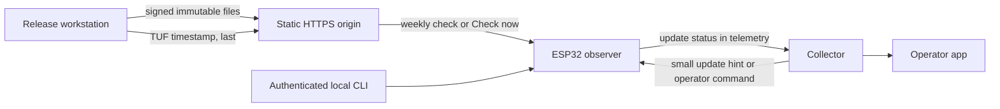
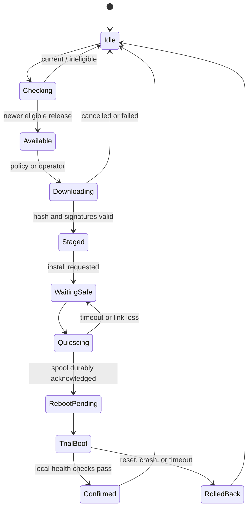

# Software updates for the ESP32-S3 observer

**Status:** implementation contract

**Scope:** custom ESP32-S3 observer hardware and its collector/operator surfaces

The observer should update like an appliance. An operator can leave it on
automatic updates, ask it to download without rebooting, or control every step.
Publishing one release is a resumable command. A failed download keeps the
current application running, a failed trial boot rolls back, and an incomplete
publication is never visible to devices.

This design builds on the existing authenticated local OTA service, dual OTA
slots, factory image, HTTPS downloader, image checks, and ESP-IDF boot rollback.
It adds the product-level system around those pieces: signed release metadata,
scheduled checks, staged installation, safe rebooting, rollout control,
operator interfaces, and production device security.

## Outcomes

- `make release` increments the build number, validates the tree, builds the
  production image, signs it, publishes immutable files, verifies the public
  result, and changes the TUF timestamp pointer last.
- Each observer has one update mode: **Manual**, **Download automatically**, or
  **Install automatically**. The recommended default is Install automatically.
- Devices check directly over HTTPS in a stable weekly slot. A collector can
  send a small hint so a newly published release is discovered sooner.
- Download and install are separate operations. A device may hold a verified
  image in its inactive OTA slot until an operator or policy asks it to reboot.
- Automatic installation waits until incoming data can be paused and every
  buffered record has a durable collector acknowledgment.
- Every accepted release has two independent proofs: TUF target metadata
  authorizes it, and ESP32 Secure Boot v2 authenticates the application image.
- Operators see the current, available, downloaded, and trial versions, with
  progress, release notes, last check, and a stable error code.
- The factory application remains an offline recovery path.

## Changes from the current OTA service

| Current service baseline | Fleet update system |
| --- | --- |
| Operator supplies a local image, URL, and digest | Device discovers a release through authenticated TUF targets |
| Download and boot selection are one request | Download stages; install selects the slot later |
| Per-device HMAC authorizes one supplied URL and digest | HMAC authorizes the local action; TUF and Secure Boot authorize content |
| Reboot follows a short best-effort drain | Receiver pauses and every final sequence receives a durable ACK |
| Status is local and transient | Local, collector, app, telemetry, and journal share one persisted state |
| One device at a time | Stable weekly checks, collector hints, cohorts, promotion, and withdrawal |
| Development security configuration | Separate unfused development and fused production profiles |

The existing 2 MiB OTA slots and immutable factory slot remain suitable. The
first production baseline still requires an attended full-device flash because
an app update cannot safely replace its own bootloader, partition table, or
eFuse trust state.

## Operator experience

The local command line and the collector-backed app expose the same model:

```text
Software Update

Current          0.1.0 (build 27)
Channel          Stable
Mode             Install automatically
Last checked     18 minutes ago
Available        0.1.1 (build 31) — Recommended
Download         Complete and verified
Install          Waiting for buffered observations to be acknowledged
```

The controls are deliberately small:

- **Check now** runs a fresh TUF metadata refresh.
- **Download** writes and verifies the inactive slot without changing the boot
  partition.
- **Install** finds a safe point, switches the boot partition, and reboots.
- **Update now** performs check, download, and safe install.
- **Cancel download** stops an active transfer or forgets a staged image.
- **Mode** selects Manual, Download automatically, or Install automatically.
- **Channel** defaults to Stable; Lab and Canary are explicit operator choices.

A security release may be labeled **Important** and may trigger an immediate
check hint. It still respects Manual mode and the safe-install rules. Release
metadata can carry a short, signed plain-text advisory for pushed information.
Long-form release notes live at an immutable HTTPS URL and are rendered by the
operator app from a bounded Markdown subset with raw HTML and remote images
disabled. They are never interpreted as device commands.

The observer has no text display. Its constellation LEDs show a brief symmetric
sweep when downloading starts and when a release becomes staged, then return to
their normal job. A persistent update failure appears in the app, telemetry,
local CLI, and diagnostic journal; it does not occupy the panel indefinitely.

## System shape



The static origin is authoritative for what may run. The collector improves
latency and gives operators a central control surface, but it is not required
for weekly discovery. A collector hint contains no download URL and grants no
new signing authority: the observer always fetches and verifies the signed
metadata itself.

## Update policy and scheduling

### Modes

| Mode | Scheduled action | Operator action |
| --- | --- | --- |
| Manual | No network check | Check, download, and install on request |
| Download automatically | Weekly check, then stage | Install on request |
| Install automatically | Weekly check, stage, then install at a safe point | Check or update immediately |

The selected mode and channel are versioned NVS settings. Factory default is
Stable plus Install automatically. Provisioning presents the choice plainly
and records an explicit selection. A converted device with no policy setting
starts in Manual until an operator chooses a mode.

Automatic modes require a valid hardware manifest with a stable EUI and board
revision. A missing or corrupt manifest reports `ELIGIBILITY_HARDWARE_UNKNOWN`
and keeps the device on its running app. The authenticated local service path
remains available for diagnosis and signed recovery images.

### Weekly checks

Each device derives one stable second of the UTC week from a hash of its public
EUI, channel, and the schedule version. It adds a small random delay at runtime.
This spreads requests evenly without sending a device identifier to the update
origin. If the slot was missed while offline, the device checks 5–30 minutes
after connectivity returns.

Failures retry with randomized 1 hour, 6 hour, and then 24 hour delays. A manual
check is immediate. Timestamp and channel metadata are small enough to fetch in
full, which avoids stale-validator and missing-cache ambiguity.

When a channel changes, the collector may send an `UPDATE_HINT` over the
device's existing outbound TLS connection. The hint carries only the channel
generation and release sequence. The device waits a random 0–30 minutes and
performs its normal TUF refresh. This gives fast discovery without a polling
storm or a new inbound service.

### Rollout cohorts

An authenticated channel target contains a rollout salt and percentage. Each
device computes its cohort locally from the salt, its public EUI, and the
release sequence. The origin therefore receives the same URL from every device
and does not learn cohort identity.

Rollout moves through Lab, Canary, and General rings. Promotion only signs new
channel, snapshot, and timestamp metadata; it never rebuilds the firmware. A
release can move from 1% to 10% to 100% while every included device receives
the exact same artifact.

## Device state machine



State, release sequence, channel generation, trusted TUF role versions,
expected image digest, byte progress, attempt count, and last error are
committed to a dedicated encrypted update-metadata NVS partition at transition
boundaries. Progress writes are rate-limited to avoid flash wear. On boot, the
updater reconciles stored state with the running and configured OTA partitions
before accepting another command.

An update is idempotent. Repeating check, download, install, or a collector
command with the same generation produces the same result and does not consume
another OTA slot or reboot twice.

### Check

1. Establish trusted wall time from retained RTC state, GNSS, or SNTP, never by
   accepting time from update metadata.
2. Fetch sequential TUF root rotations, then `timestamp.json`, using
   `Accept-Encoding: identity` with strict response limits, TLS validation, and
   no redirects.
3. Run the TUF client workflow: signature thresholds, role versions, expiry,
   rollback checks, snapshot hashes, and consistent-snapshot names.
4. Fetch the versioned targets roles and resolve the configured channel target.
5. Fetch the immutable release target and verify its TUF length and SHA-256.
6. Match chip, board family, hardware revision, partition layout, minimum
   updater version, release sequence, and rollout cohort.
7. Record availability and its authenticated short advisory.

Semantic version strings are for people. Eligibility and ordering use unsigned
64-bit release and build numbers covered by the signatures. For this repository,
the firmware release sequence is `BUILD_NUMBER`; TUF role versions are separate
protocol counters.

### Download and stage

Download streams the content-addressed application into the inactive OTA slot.
The updater validates size bounds, the complete artifact SHA-256, the ESP image
metadata, project and board markers, and the Secure Boot signature. It then
records the staged release but does **not** call `esp_ota_set_boot_partition()`.
The current application continues running normally.

A resumed download starts again from byte zero. At roughly 2 MiB this is simpler
and safer than persisting partial-block state, and it avoids trusting range
responses or a torn hash checkpoint.

Before installation, the device fetches the current channel again. A withdrawn,
superseded, expired, or newly ineligible staged release is forgotten without
booting it. A network outage does not invalidate an already verified release,
but automatic installation waits until freshness can be re-established. An
explicit local install may use the previously trusted release target when the
last accepted channel state has not declared the release withdrawn.

### Find a safe reboot point

The present spool is memory-backed, so an ordinary reboot can discard unacked
observations. Automatic installation therefore uses this sequence:

1. Wait for a healthy collector connection and for the spool to reach zero.
2. Pause the receiver producer at a complete frame boundary.
3. Capture the final sequence watermark and let the pusher drain through it.
4. Require a durable ACK at or beyond that watermark.
5. Stop update-facing services, write `reboot_pending`, select the staged OTA
   partition, and restart.

If the connection drops or the acknowledgment deadline expires, resume the
receiver and return to `waiting_safe`. The device remains useful and retries in
its next allowed install window. A remotely configured maintenance window may
narrow when this happens; the default is any safe time.

The local CLI offers `--discard-backlog` for an attended emergency install. It
prints the number of records that will be lost and requires an explicit flag.
The automatic and one-click normal paths never use it.

### Trial boot and rollback

ESP-IDF application rollback marks the new slot pending verification. The trial
application performs bounded local checks:

- running partition and signed release identity agree;
- NVS settings and update-state migrations are readable;
- the spool can allocate its configured tier;
- the receiver and pusher tasks reach their local ready points;
- the update component can append a diagnostic record.

The checks do not require a GNSS fix, hardware-manifest EEPROM, Internet access,
or collector availability. Those dependencies may be absent for legitimate
reasons. Once local health passes, the app marks itself valid quickly and
reports network and peripheral health separately.

Any configuration migration executed before confirmation must be backward
readable or copy-on-write. A reset, crash, watchdog, or failed health check
before confirmation lets the bootloader return to the previous OTA slot. The
next status report records both the failed and restored versions.

## TUF publication format

The metadata layer follows the [TUF 1.0 specification](https://theupdateframework.github.io/specification/latest/),
including threshold root trust, delegated targets, version and expiry checks,
and consistent snapshots. This uses a reviewed update-security model for key
rotation and rollback, freeze, mix-and-match, and partial-publication attacks.
Secure Boot remains an independent, chip-enforced signature check on the
selected application.

The update origin exposes a conventional static TUF repository:

```text
/firmware/v1/metadata/1.root.json
/firmware/v1/metadata/2.root.json
/firmware/v1/metadata/timestamp.json
/firmware/v1/metadata/42.snapshot.json
/firmware/v1/metadata/17.targets.json
/firmware/v1/metadata/9.releases.json
/firmware/v1/metadata/23.stable.json
/firmware/v1/targets/channels/<sha256>.stable.json
/firmware/v1/targets/releases/<sha256>.31.json
/firmware/v1/targets/artifacts/<sha256>.navfeeder-esp.bin
/firmware/v1/targets/artifacts/<sha256>.provenance.json
/firmware/v1/targets/artifacts/<sha256>.licenses.json
/firmware/v1/targets/notes/<sha256>.31.md
```

The names illustrate TUF consistent snapshots; the publisher derives their
exact names according to the pinned specification and metadata format. Root,
versioned metadata, channel targets, release manifests, images, provenance,
licenses, and notes are immutable. Only unversioned `timestamp.json` changes in
place, and the publisher replaces it last.

### Fixed device profile

The embedded client supports a deliberately narrow TUF profile:

- TUF 1.0 JSON metadata with one pinned canonical encoding;
- ECDSA P-256/SHA-256 metadata signatures and SHA-256 file hashes;
- consistent snapshots enabled;
- fixed `releases`, `stable`, `canary`, and `lab` target delegations;
- maximum metadata size, target count, delegation depth, string length, and
  total update bytes set at build time;
- integer-only release fields, duplicate-key rejection, valid UTF-8, and no
  dynamic mirror or arbitrary delegated-role discovery;
- a fixed update start time and a persisted last-trusted time that never moves
  backward for expiry decisions.

Unsupported algorithms, roles, extensions, or limits fail closed. The device
implementation must pass repository fixtures produced by the official
[Python TUF reference implementation](https://github.com/theupdateframework/python-tuf)
and independent malformed-input tests. TUF compatibility is an acceptance claim
backed by those vectors and conformance checks.

### Roles and targets

The root role is embedded in the signed factory and OTA applications. It uses a
2-of-3 offline threshold and authorizes the top-level targets, snapshot, and
timestamp roles. Clients fetch numbered root versions sequentially and require
the old and new root thresholds during rotation.

Top-level targets also uses an offline threshold and changes only when a
delegation or its key changes. The release role may use a separate offline/HSM
threshold chosen to keep routine releases practical while surviving one lost
key.

Top-level targets delegates these disjoint paths:

- `releases/*` and `artifacts/*` to an offline release role;
- `channels/stable.json` to the Stable promotion role;
- equivalent channel paths to the Lab and Canary promotion roles.

The offline release role authenticates each immutable release manifest and its
artifact, provenance, license, and notes targets. A channel promotion key can
select, stage, pause, or withdraw an already authorized release. It cannot add
a new release artifact. Snapshot prevents role mix-and-match; the short-lived
online timestamp identifies the current snapshot and limits freeze attacks.

Initial metadata lifetimes balance a weekly client schedule with useful freeze
detection:

| Role | Refresh | Expiry |
| --- | --- | --- |
| Timestamp | Daily automated signing | 14 days |
| Snapshot and channel roles | On change, or weekly automated renewal | 45 days |
| Release targets and top-level targets | Each release; planned offline renewal | 1 year |
| Root | Planned offline ceremony | 2 years |

Collector alerts begin 90 days before any offline role expires. The online
refresh job can renew timestamp, snapshot, and unchanged channel metadata; it
cannot extend root or release authority.

The channel target contains:

- schema and monotonically increasing channel generation;
- release-manifest target path, release sequence, and priority;
- rollout salt, percentage, and eligible rings;
- withdrawn release sequences;
- a bounded advisory classification and plain-text summary.

The immutable release target contains:

- release sequence, `VERSION`, `BUILD_NUMBER`, source revision, and publish time;
- target chip, board family, hardware revision range, partition-layout ID, and
  minimum updater version;
- application target path, byte length, final signed-image SHA-256, and Secure
  Boot key identity;
- ESP security version, provenance target and digest, and immutable notes target;
- required collector protocol capability, if a release truly needs one.

The device persists the highest trusted version for every TUF role, the channel
generation, installed release sequence, and last trusted time. A check requires
trusted time; the current firmware already needs it for HTTPS certificate
validation. A verified, staged image may survive metadata expiry, but automatic
installation refreshes metadata first. An attended local install can use the
previously trusted staged target and reports that freshness could not be
re-established.

### Key roles

| Key | Purpose | Storage and authority |
| --- | --- | --- |
| Secure Boot RSA-3072 key | Authenticate the ESP bootloader and app image | Offline signer or HSM; public digest fused into each production ESP32-S3 |
| TUF root threshold | Authorize and rotate TUF roles and keys | 2-of-3 offline keys; initial public root embedded in authenticated firmware |
| TUF release targets | Authorize immutable release files | Offline signer; cannot change a channel or manufacture a Secure Boot signature |
| TUF channel targets | Promote, pause, or withdraw authorized releases | Separate narrow key for each channel |
| TUF snapshot/timestamp | Bind a consistent repository view and freshness | Online publisher keys with short expiry and limited roles |
| Device update HMAC key | Authorize local service requests | Per-device encrypted NVS secret; cannot authorize firmware |
| Device identity key | Authenticate an observer to its collector | ATECC608C non-extractable key once provisioned; never used to sign releases |

The TLS certificate protects transport and privacy. Firmware authorization
requires an authorized TUF release target and a Secure Boot signature.
Compromise of the origin or collector cannot produce a valid new application
without both. Compromise of a promotion or timestamp key can disrupt
availability, so the app reports expired or invalid metadata distinctly and
the offline root can rotate those roles.

Provision multiple Secure Boot public-key digests where practical: one active
key plus independent recovery/rotation capacity. Private signing material is
never stored in this repository, a firmware build directory, a CI variable, or
release logs.

## Production ESP32 security

Production observers should enable all three controls:

1. **Secure Boot v2** with RSA-PSS/RSA-3072 verifies the bootloader and every app
   at boot and during OTA.
2. **Flash encryption in Release mode** protects code and data against direct
   flash readout and modification with a unique per-device key.
3. **NVS encryption** protects Wi-Fi, collector, update-control, and other NVS
   credentials with its separate XTS scheme and protected `nvs_keys` partition.

The current project configuration leaves Secure Boot and flash encryption off
and explicitly sets `CONFIG_NVS_ENCRYPTION=n`. That configuration is limited to
development and service baselines. Production uses the profile below.

The production configuration enables the ESP-IDF options corresponding to:

```text
CONFIG_SECURE_BOOT=y
CONFIG_SECURE_BOOT_V2_ENABLED=y
CONFIG_SECURE_BOOT_BUILD_SIGNED_BINARIES=n
CONFIG_SECURE_FLASH_ENC_ENABLED=y
CONFIG_SECURE_FLASH_ENCRYPTION_MODE_RELEASE=y
CONFIG_SECURE_ENABLE_SECURE_ROM_DL_MODE=y
CONFIG_NVS_ENCRYPTION=y
CONFIG_NVS_SEC_KEY_PROTECT_USING_FLASH_ENC=y
CONFIG_BOOTLOADER_APP_ROLLBACK_ENABLE=y
CONFIG_BOOTLOADER_APP_ANTI_ROLLBACK=n
CONFIG_APP_REPRODUCIBLE_BUILD=y
```

Disabling build-time signing is intentional: it produces the secure-padded
input for the remote/HSM signer without placing its private key on the build
machine. The generated configuration is pinned and reviewed against the chosen
ESP-IDF release because some derived option names vary by target and SDK
version.

Add a 4 KiB `data,nvs_keys` partition with the `encrypted` flag at the start of
the existing gap after `otadata`; the application offsets need not move. Reserve
a 128 KiB `data,nvs` partition named `update_meta` from the unallocated space
after the OTA slots, and initialize it with the NVS encryption keys. It holds
trusted TUF metadata and the update transaction without crowding device
configuration NVS.

Secure Boot and flash encryption can enlarge the bootloader, so the production
build must also prove that it fits before the partition-table offset. If that
check fails, move the table and small data partitions within the pre-factory
space, then assign a new partition-layout ID and install it only through the
service baseline. The device generates its unique flash and NVS keys on-chip
during controlled production provisioning.

Keep development builds on unfused boards. A separate production provisioning
command builds and flashes the complete signed baseline, verifies hashes and
eFuse state, performs a second clean boot, exercises secure OTA, and emits a
non-secret provisioning record. `make release` never changes eFuses.

Keep Secure ROM Download mode available in its restricted form because the
board intentionally exposes service USB and UART paths. Production validation
must prove what operations remain possible before locking a manufacturing
profile. JTAG and unrestricted download paths are disabled by the production
security configuration.

Do not enable eFuse hardware anti-rollback in the first release. ESP-IDF's trial
boot rollback remains enabled. Raising the hardware security-version floor
would make the immutable factory image unbootable unless factory recovery were
updated transactionally first. Initially, signed monotonic release sequences
block ordinary downgrade. Hardware anti-rollback can follow only with a tested
factory-refresh and power-loss protocol.

Existing provisioned devices cannot gain this complete security state through
an app-only OTA: the bootloader, partition table, encrypted NVS key partition,
and eFuses are part of the baseline. They require one attended USB/service
conversion, backup of permitted identity history, reprovisioning, and the same
recovery tests as a new production unit.

Official ESP-IDF references:

- [Secure Boot v2](https://docs.espressif.com/projects/esp-idf/en/v5.5.4/esp32s3/security/secure-boot-v2.html)
- [Flash encryption](https://docs.espressif.com/projects/esp-idf/en/v5.5.4/esp32s3/security/flash-encryption.html)
- [NVS encryption](https://docs.espressif.com/projects/esp-idf/en/v5.5.4/esp32s3/api-reference/storage/nvs_encryption.html)
- [OTA rollback](https://docs.espressif.com/projects/esp-idf/en/v5.5.4/esp32s3/api-reference/system/ota.html)

## Recovery model

The normal update changes only an application slot. It never replaces the
bootloader or partition table. The signed, encrypted factory application stays
untouched and can provide provisioning plus a local signed-image upload.

Recovery levels are:

1. A failed download leaves the running app unchanged.
2. A failed trial boot returns to the previous OTA app automatically.
3. An attended local action clears OTA selection and boots the factory app.
4. Cover-off BOOT and RESET access the restricted Secure ROM Download mode for
   a documented depot procedure.
5. A module with destroyed bootloader/app ciphertext and a non-escrowed on-chip
   flash key is replaced.

Erasing ordinary NVS intentionally returns the factory app to provisioning; it
does not weaken signature verification. An optional depot manufacturing profile
may generate and securely escrow each device's unique flash key if full-flash
repair is worth the added key-custody burden. The default field design relies on
the untouched factory partition and module replacement for catastrophic damage.

## One-command release workflow

The repository root owns the release interface:

```text
make release                         # build and begin the Stable rollout
make release-dry-run                 # validate without reserving or publishing
make release-resume RELEASE=31       # continue an interrupted transaction
make release-promote RELEASE=31 PERCENT=25
make release-withdraw RELEASE=31
make release-check RELEASE=31        # verify the public files and signatures
make release-refresh-online          # renew short-lived TUF metadata
```

`make release` is one transaction with a durable local state directory:

1. Acquire a release lock. Require the expected branch, a clean tracked tree,
   configured push remotes, pinned toolchain, and available signer adapters.
2. Increment and commit `BUILD_NUMBER`. A reserved number is never reused, even
   if a later step fails. `VERSION` changes only through an explicit version
   command.
3. Run the repository checks and two isolated, reproducible ESP32-S3 production
   builds from the exact clean commit. Require their secure-padded app inputs to
   match byte-for-byte before signing.
4. Generate provenance and license documents, including source revision,
   ESP-IDF revision, dependency lock, ELF SHA-256, and unsigned-image SHA-256.
5. Send the padded app to the configured offline/HSM Secure Boot signer. Receive
   the signed app, verify it with the expected public key, and calculate the
   final artifact digest and length.
6. Construct the immutable release manifest, add the manifest and artifacts to
   the delegated TUF release role, and sign that role offline. Validate schemas,
   targets, hashes, sizes, sequence, updater floor, and key IDs locally.
7. Construct the first channel target and sign its delegated targets metadata,
   then generate candidate snapshot and timestamp metadata.
8. Create the annotated release tag and push the source commit and tag to every
   configured software remote.
9. Upload artifacts, provenance, licenses, notes, the release manifest, and all
   versioned TUF metadata under their immutable names.
10. Fetch every public URL over HTTPS. Require no redirect, exact content length,
    identity encoding, expected media type, matching hashes, and valid
    signatures.
11. Atomically replace unversioned TUF `timestamp.json` **last**, then run a
    clean client refresh from the public path and verify the entire chain.
12. Print the release sequence, initial cohort, public digest, status command,
    promotion command, and withdrawal command.

If any step before timestamp replacement fails, no device sees the candidate.
Rerunning `release-resume` reads the signed transaction record, checks completed
outputs byte-for-byte, and continues. It never rebuilds a different artifact
under an existing release sequence.

The signer and publisher are adapters configured outside the repository. A
fully offline signer can use explicit export/import directories while retaining
the same resumable command. Logs contain public keys, key IDs, digests, and
signer receipts, never private material or device credentials.

## Static origin requirements

The existing site can host `/firmware/v1/` as an isolated static tree outside
the ordinary website deployment directory. Its HTTP server and TLS reverse
proxy must provide:

- direct HTTPS URLs with no redirect on any device-facing path;
- `application/json` for metadata, `application/octet-stream` for images, and
  `text/markdown; charset=utf-8` for release notes;
- a correct `Content-Length` and no content transformation or compression;
- `Cache-Control: no-store` for unversioned `timestamp.json`;
- `Cache-Control: public, max-age=31536000, immutable` for release content;
- disabled directory listings and content negotiation;
- atomic same-filesystem rename when replacing `timestamp.json`;
- access logs and rate limits that do not require a device identifier.

Publisher credentials may create immutable files and atomically replace
`timestamp.json`, but cannot rewrite or delete an existing immutable object.
Site deployment must not prune the firmware tree. Release preflight checks
these properties from the public endpoint before promotion.

## Collector protocol and APIs

Add one bounded collector-to-device GNF1 control frame. It fits within the
existing small inbound buffer and old firmware ignores its unknown frame type.
The payload is fixed-width and versioned:

```text
version | action | flags | command_id | channel_generation | release_sequence | expires_at
```

Actions are `CHECK`, `STAGE`, `APPLY`, and `CANCEL`. Commands are idempotent;
the collector retries until it observes the resulting state. A periodic hint
uses `CHECK` plus the hint flag and is ignored in Manual mode. An explicit
operator `CHECK` works in every mode. `STAGE` and `APPLY` represent an
authenticated operator's desired state, but they still pass all device
signature, eligibility, withdrawal, expiry, and safe-reboot checks.

The collector stores the authenticated actor, command ID, creation and expiry
times, requested release, and observed result. The app distinguishes Requested,
Accepted, Downloaded, Rebooting, Confirmed, and Rolled back; it never reports a
desired state as completed before device telemetry confirms it. Expired commands
are not delivered to a device that reconnects much later.

Update status travels in the existing observer-details telemetry as a new,
skippable TLV:

- policy, channel, and updater state;
- running, available, staged, and failed release sequences;
- byte progress and last successful check time;
- stable error domain/code and retry time;
- Secure Boot, flash-encryption, NVS-encryption, and partition-layout status;
- public signing key IDs, never secrets.

Collector storage retains transitions rather than every repeated status sample.
It exposes current state to the operator API and metrics for check failures,
download failures, staged age, install delay, trial rollback, version adoption,
and security-profile drift.

The authenticated local service evolves without removing current pairing:

```text
GET  /ota/v1/status
POST /ota/v1/check
POST /ota/v1/download
POST /ota/v1/install
POST /ota/v1/cancel
PUT  /ota/v1/policy
```

The local tool maps these to `ota.py status`, `check`, `download`, `install`,
`update`, `cancel`, and `set-policy`. Normal use no longer asks the operator for
a firmware URL, local binary, or SHA-256. A separate service-only command retains
that capability for recovery while still requiring valid firmware signatures.

## Stable errors

Errors are machine-readable and keep their last human explanation:

The wire and NVS record store a 16-bit domain plus 16-bit reason. CLI and app
strings use stable names such as `META_EXPIRED`, `ARTIFACT_BAD_SIGNATURE`, and
`SAFETY_ACK_TIMEOUT`; prose may improve without changing those identifiers.

| Domain | Examples | Automatic result |
| --- | --- | --- |
| Network | DNS, TLS, timeout, offline | Keep current state and retry with backoff |
| Metadata | bad signature, replay, malformed, expired | Reject, journal, and retry only after new metadata |
| Eligibility | wrong board, old updater, rollout excluded | Do not download; report exact reason |
| Artifact | size, hash, image marker, Secure Boot signature | Erase staged slot and retain current app |
| Storage | OTA write, NVS state, insufficient partition | Stop automatic attempts until conditions change |
| Safety | spool not drained, collector unavailable | Resume collection and wait |
| Trial | crash, watchdog, health failure | Bootloader rollback and report restored version |

An error never collapses to only “update failed.” The CLI and app show the stage,
stable code, occurrence time, retry time, and one useful next action.

## Withdrawal and downgrade

Withdrawal adds a release sequence to the authenticated channel target and
publishes a new TUF snapshot. Devices cancel its download or staged install. A
device already running it reports the withdrawn state and waits for a higher signed
release; unattended downgrade is not attempted.

Emergency rollback is a new forward-numbered release built from the last known
good source. This keeps migrations, replay protection, and future hardware
anti-rollback coherent. An attended factory recovery remains available when the
running app cannot participate.

## Acceptance gates

The system is ready for default automatic installation only after these pass:

- official and adversarial TUF workflow tests for thresholds, strict parsing,
  expiry, replay, mix-and-match, partial publication, and key rotation;
- injected disconnects, truncation, corrupt blocks, incorrect lengths, bad
  hashes, wrong images, and power cuts throughout download and NVS transitions;
- on-target interruption at every state boundary, including repeated commands;
- crash, watchdog, and power-cut trials before and after app confirmation,
  proving bootloader rollback and status reconciliation;
- a collector outage during install, proving the receiver resumes and no
  automatic path discards unacknowledged records;
- compatibility with an old collector, old device firmware, and the factory app;
- simulated fleet scheduling and rollout distributions without an origin-visible
  device identifier;
- public-origin tests for headers, cache policy, redirects, byte identity,
  atomic publication, partial uploads, and stale intermediaries;
- production-board checks for eFuse state, Secure Boot rejection, encrypted
  flash readout, encrypted NVS credentials, signed OTA, restricted service-mode
  recovery, and an untouched factory image;
- a 1% Canary soak followed by explicit promotion gates on rollback rate, check
  success, download success, and time-to-confirm.

Bench evidence is attached to the release transaction by test name, board
revision, running release, and non-secret security state. “Built successfully”
is not a production security or recovery test.

## Delivery order

1. **Metadata and state core:** constrained TUF verifier, persisted state
   machine, separated stage/apply operations, and local CLI.
2. **Safe installation:** receiver quiesce/drain handshake, trial reconciliation,
   rollback reporting, and power-loss tests.
3. **Publisher:** schemas, signer adapters, resumable release transaction,
   immutable static tree, server rules, and public preflight.
4. **Fleet controls:** weekly scheduler, rollout cohorts, collector hint/control
   frame, status telemetry, metrics, and operator app.
5. **Production baseline:** Secure Boot v2, flash and NVS encryption, factory
   recovery, service conversion, and manufacturing verification.
6. **Default automatic mode:** Canary soak, promotion gates, recovery rehearsal,
   and then factory-default enablement.

The first externally deployed automatic-update build must already use the
production security baseline. Development can implement and test the earlier
phases on unfused boards, but an unsigned field baseline cannot securely turn
itself into the final trust model.
