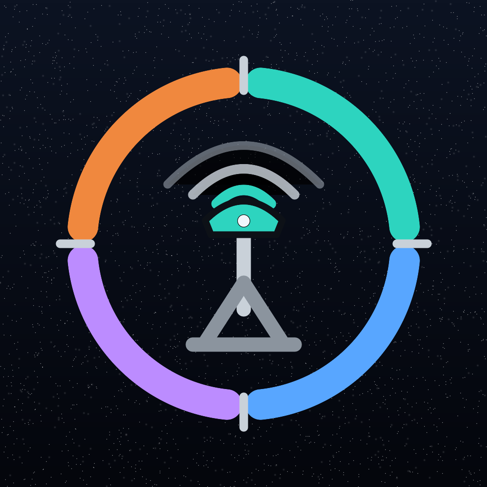

# App icon — Integrity Station



**“Receiver dial.”** The four constellation-colored quadrants and cardinal ticks
continue intsat’s reticle-on-starfield family. The center is a rooftop GNSS radome,
receiving three clean wavefronts on a mast: this app watches the station itself,
rather than repeating mapintsat’s satellite skyplot.

The colors are the canonical dark-theme GNSS colors from
`apps/intsat/docs/COLOR_STANDARDS.md`: GPS teal `#2dd4bf`, Galileo blue
`#58a6ff`, BeiDou violet `#bc8cff`, and GLONASS orange `#f0883e`. The support
grey is `#8b949e`; the brighter instrument grey is `#c9d1d9`. The field is the
deep-navy star gradient, `#0c1322` to `#04060c`.

## Source and rendering

The source mark is `icon-source/integrity-station.svg`. It is transparent; the
renderer creates the starfield underneath it at each final pixel size. This
preserves the small stars instead of destroying them by downscaling a 1024 px
raster, matching the rule in `apps/intsat/docs/ICONS.md` and the mapintsat icon
pipeline.

MacPorts ImageMagick 6 is the only required renderer:

```sh
cd apps/navlistener/swift
sh scripts/render-app-icon.sh
```

The script writes the iOS 1024 px icon and the full macOS 16–1024 px ladder
directly into `Assets.xcassets/AppIcon.appiconset`. The vector is original
art and remains the source of truth for later hand tuning.
